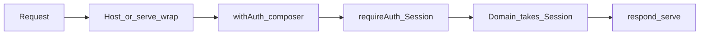

# Advanced usage

Enterprise APIs need **non-omittable policy**: auth, tenancy, and audit that cannot be forgotten on a new route. Middleware is one way to buy that. never-rest’s bet is different — handlers already return `Result`, so policy is ordinary composition, made mandatory with types and shared composers rather than an interceptor registry.

Short thesis: [concepts.md — No middleware](./concepts.md#no-middleware--the-chain-is-the-middleware). Pattern catalogue (gates, tees, recover, kitchen sink): [railway-patterns.md](./railway-patterns.md).

Examples on this page are **userland**. The library does not ship `withAuth` or a middleware API; you compose on top of [`Handler`](./api.md#handler) / [`serve`](./api.md#serve). For the same policy on [`./local`](./api.md#eddy-worksnever-restlocal), compose on [`LocalHandler`](./api.md#localhandler) — there is no `request` to wrap.



## What enterprise actually asks for

Strip Express nostalgia and four qualities remain:

| Quality | Meaning |
| --- | --- |
| **Mandatory** | Auth / tenancy / audit cannot be omitted on a new route |
| **Central** | Change the policy once; every route inherits it |
| **Ordered** | Identity before domain; audit after success; etc. |
| **Evidential** | You can show an auditor that the policy always runs |

Middleware delivers the first three by ambient wrapping. It delivers the fourth poorly — you prove stack config, not intent. A typed railway can deliver all four when you design for capabilities and composers.

## Guarantee ladder

| Mechanism | Strength | Failure mode |
| --- | --- | --- |
| Doc / “always call `requireAuth`” | Soft | Someone ships a naked handler |
| LLM agent convention | Soft–medium | Drift, surfaces the agent never sees, “just this once” |
| CI / AST lint (“handler must mention X”) | Medium | Brittle; easy to satisfy literally without meaning it |
| **Capability types** (`Session` required to call domain) | Hard | Domain APIs that accept raw ids / `Request` undermine it |
| **Registration composers** (`withAuth`, router only accepts composed handlers) | Hard | Public routes need an explicit escape hatch |
| Effect / phantom “pipe must include Auth” | Hardest (awkward in TypeScript) | Complexity cost — usually unnecessary once capabilities + composers exist |
| Gateway / mesh policy outside the process | Hardest for *ingress* | Does not help mid-chain commercial gates |

Agents make convention cheap. They do **not** replace mechanical impossibility of a naked route — and compliance teams eventually ask for the mechanical one.

## Capability types

A gate should produce a **capability**, not a boolean. Domain functions refuse to run without it. Omitting auth becomes a type error, not a code-review preference.

```ts
import { errAsync, okAsync, type ResultAsync } from 'neverthrow';
import { railError, type RailError } from '@eddy-works/never-rest';

type Session = { userId: string; roles: readonly string[] };

type Invoice = { id: string; ownerId: string; total: number };

function requireAuth(request: Request): ResultAsync<Session, RailError<'unauthorized'>> {
  const header = request.headers.get('authorization');
  if (header === null) {
    return errAsync(railError('unauthorized', 'Missing credentials'));
  }
  return loadSession(header);
}

/** Domain takes Session — not Request, not a bare userId from the client. */
function loadInvoiceFor(
  session: Session,
  id: string,
): ResultAsync<Invoice, RailError<'not_found' | 'forbidden'>> {
  return findInvoice(id).andThen((invoice) => {
    if (invoice.ownerId !== session.userId && !session.roles.includes('billing')) {
      return errAsync(railError('forbidden', 'Not your invoice'));
    }
    return okAsync(invoice);
  });
}

// Legal — Session flows from the gate.
getInvoice: ({ params, request }) =>
  requireAuth(request).andThen((session) => loadInvoiceFor(session, params.id)),
```

Illegal (does not typecheck) — domain will not accept a raw string where `Session` is required:

```ts
// @ts-expect-error — string is not Session
getInvoiceBroken: ({ params }) => loadInvoiceFor(params.id as never, params.id),
```

Same pattern for `TenantContext`, `ResidencyCleared`, `Audited<T>`, and other mid-chain clearances. Reach for phantom “effect lists on `Result`” only when policy is polymorphic across many optional composers; for “every invoice route is authed,” capabilities win.

Align handler args with the real [`Handler`](./api.md#handler) shape: `HandlerArgsOf & { request, context }` — typed `params`, `query`, and `body` from schemas.

## Composer wrappers

Capabilities stop illegal *calls*. Composers make policy **central** and **mandatory at registration**: change `withAuth` once; every route that uses it inherits the gate. Public routes use a named escape hatch — explicit, not ambient skip.

```ts
import type { Result, ResultAsync } from 'neverthrow';
import type { RailError } from '@eddy-works/never-rest';
import type { ContractDef, HandlerArgsOf, OutputOf, RouteDef } from '@eddy-works/never-rest/contract';
import type { Handler } from '@eddy-works/never-rest/server';

type Session = { userId: string; roles: readonly string[] };

type AuthedArgs<TRoute extends RouteDef, TContext> = HandlerArgsOf<TRoute> & {
  request: Request;
  context: TContext;
  session: Session;
};

type AuthedHandler<TRoute extends RouteDef, TContext> = (
  args: AuthedArgs<TRoute, TContext>,
) =>
  | Result<OutputOf<TRoute>, RailError<TRoute['errors'][number]>>
  | ResultAsync<OutputOf<TRoute>, RailError<TRoute['errors'][number]>>
  | Promise<Result<OutputOf<TRoute>, RailError<TRoute['errors'][number]>>>;

function withAuth<TRoute extends RouteDef, TContext>(
  handler: AuthedHandler<TRoute, TContext>,
): Handler<TRoute, TContext> {
  return (args) =>
    requireAuth(args.request).andThen((session) =>
      handler({ ...args, session }),
    );
}

function withRole<TRoute extends RouteDef, TContext>(
  role: string,
  handler: AuthedHandler<TRoute, TContext>,
): Handler<TRoute, TContext> {
  return withAuth((args) =>
    requireRole(args.session, role).andThen((session) =>
      handler({ ...args, session }),
    ),
  );
}

/** Explicit unauthenticated surface — health, public webhooks, etc. */
function publicHandler<TRoute extends RouteDef, TContext>(
  handler: Handler<TRoute, TContext>,
): Handler<TRoute, TContext> {
  return handler;
}
```

Register composed handlers (and only those) on your contract:

```ts
import { serve, type Handlers } from '@eddy-works/never-rest/server';

const handlers = {
  getInvoice: withRole('billing', ({ params, session }) =>
    loadInvoiceFor(session, params.id)
      .andTee((invoice) => audit.read('invoice', invoice.id))
      .andThen((invoice) => touchLastViewed(invoice.id).map(() => invoice)),
  ),

  health: publicHandler(() => okAsync({ ok: true as const })),
} satisfies Handlers<typeof contract, AppContext>;

const fetchHandler = serve(contract, handlers, { origin: 'my-api' });
```

**Ordered** lives in the wrapper body. **Evidential** becomes “show the type of `handlers`” and the single composer module — stronger than reconstructing `app.use` order.

Layer composers the same way: `withTenant(withAuth(handler))`, or fold tenancy into one `withBillingGate` if that is your product boundary.

## What stays outside the railway

Host chrome and ingress policy are not `Result` concerns. They must run regardless of which route matched — often before your process sees the request.

| Need | Why a handler chain is not enough |
| --- | --- |
| Edge auth for *all* traffic including unknown paths | Must run before route match |
| Multi-language or multi-repo fleets | Types do not travel across services |
| Policy owned by a different team / deployable | Platform ships gateway or mesh; app ships handlers |
| CORS, max body, TLS, WAF | Host / edge, not domain |
| File bytes, SSE, NDJSON pipes | [Files and streams](./files-and-streams.md) — not a contract route |

Thin wrap around `serve` for process-local HTTP chrome (request id, timing). Keep product gates on the railway.

```ts
const inner = serve(contract, handlers, { origin: 'billing' });

export function fetchHandler(request: Request): Promise<Response> {
  const requestId = request.headers.get('x-request-id') ?? crypto.randomUUID();
  const started = performance.now();

  return Promise.resolve(inner(request)).then((response) => {
    const headers = new Headers(response.headers);
    headers.set('x-request-id', requestId);
    headers.set('x-response-time-ms', String(Math.round(performance.now() - started)));
    return new Response(response.body, {
      status: response.status,
      statusText: response.statusText,
      headers,
    });
  });
}
```

Use an API gateway or service mesh when the guarantee must hold *outside* your typed app surface. Use the railway for mid-story commercial and legal gates (MSA signed, residency cleared, capacity available) — see [railway-patterns.md — Kitchen sink](./railway-patterns.md#kitchen-sink--white-label-enterprise-tenant-provisioning). Those decisions belong in the provision chain, not in `app.use` at the HTTP edge.

## Agents and CI as amplifiers

Agents and team convention make composers *easy to keep*. They do not *create* the guarantee. Types and registration do.

Practical checks (tooling-agnostic):

1. New routes go through `withAuth` / `withRole` / `publicHandler` only — no raw `Handler` literals for authenticated surfaces.
2. Domain modules accept `Session` (or other capabilities), never `Request` or client-supplied “acting as” ids without a gate.
3. CI or an agent review flags `Handlers` entries that are neither composed nor wrapped in `publicHandler`.
4. Document the escape hatch: `publicHandler` is intentional and reviewable.

Soft amplifier on hard foundation: capabilities + composers + agents/CI that only generate routes through those composers.

## Worked end-to-end

Capability + composer + tee / after-effect — the invoice story from the concepts page, made non-omittable at registration:

```ts
import { okAsync } from 'neverthrow';
import type { Handlers } from '@eddy-works/never-rest/server';

const handlers = {
  getInvoice: withRole('billing', ({ params, session }) =>
    loadInvoiceFor(session, params.id)
      .andTee((invoice) => metrics.increment('invoice.read', { plan: invoice.plan }))
      .orTee((error) => log.warn('invoice.read_failed', { code: error.code }))
      .andTee((invoice) => audit.read('invoice', invoice.id))
      .andThen((invoice) => touchLastViewed(invoice.id).map(() => invoice)),
  ),

  health: publicHandler(() => okAsync({ ok: true as const })),
} satisfies Handlers<typeof contract, AppContext>;
```

Read it top to bottom: role gate (via composer) → domain (requires `Session`) → metrics / audit tees → required touch. Same interceptor jobs as middleware; failure stays `Err` data.

Illegal registration — domain cannot be called without a session, and authenticated routes should not bypass the composer:

```ts
const broken = {
  // Missing withAuth / withRole — team convention + CI should reject this shape.
  getInvoice: ({ params, request }) =>
    // @ts-expect-error — loadInvoiceFor expects Session, not a string user id
    loadInvoiceFor(request.headers.get('x-user-id') ?? '', params.id),
} satisfies Handlers<typeof contract, AppContext>;
```

## Summary

| With middleware | With railway + capabilities + composers |
| --- | --- |
| Cross-cutting is declared once, hidden from handlers | Cross-cutting is visible in composers; handlers stay thin |
| Errors often leave the type system at `throw` | Failures stay `Err` end to end |
| Story reconstructed from stack order | Story reads in one composer + one handler chain |
| Easy global consistency | Easy local correctness; consistency is a composition habit |

You need middleware’s **qualities** as soon as omission is a security or compliance incident. You rarely need middleware as a **mechanism**. Make the illegal chain unrepresentable — that is stricter than `app.use(auth)`, and it stays readable.
