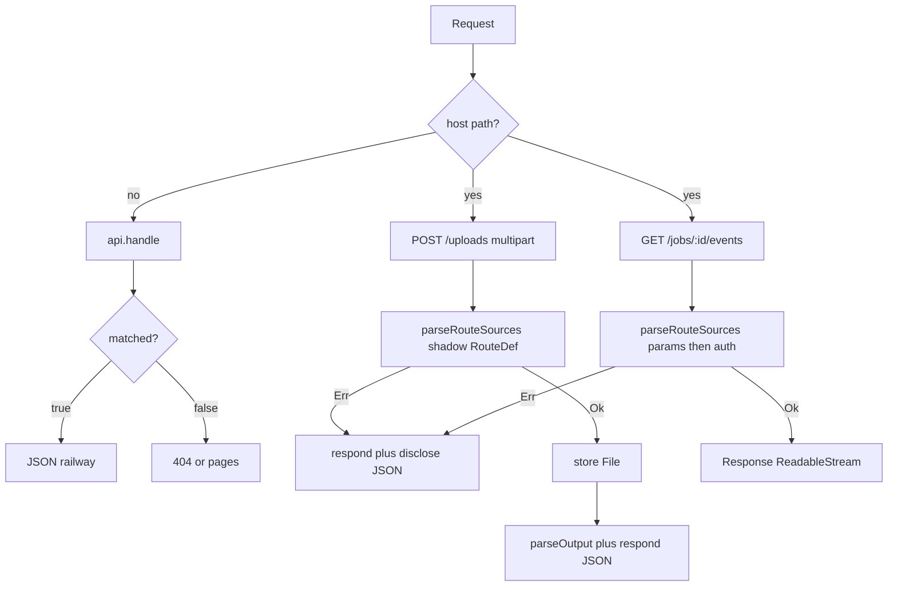

# Plan: files and streams 0.6

Mission: make the 0.5 feasibility verdict operational — no multipart or streaming on `serve` / `createClient` / `toOpenAPI`, and a documented, tested recipe for ticket URLs plus sibling host handlers that reuse the parse/respond kit.

Definition of done:

- A guide at [`docs/files-and-streams.md`](docs/files-and-streams.md) states the rule (byte paths are not on the served contract), the two recipes (ticket URL; sibling handler), the anti-patterns, and the `toNodeHandler` upload-buffering caveat.
- An in-process example [`examples/files-and-streams`](examples/files-and-streams) (gateway-sized, not a sixth framework mount) dispatches `handle()` then sibling multipart + SSE, and conformance proves the seams.
- Comparison, migrating, concepts, advanced-usage, API `handle()` / `toNodeHandler`, examples indexes, README, and the agent skill all point at the guide. Streaming and multipart stay “not in scope” for the library.
- No `RouteDef` flag, no new package exports, no changes to `readRequestBody`, `jsonResponse`, `parseOutput`, `mapResponse`, `buildRequest`, or `toOpenAPI` media types.
- Full gate suite passes. Version cut to `0.6.0` is a follow-up PR after this lands on `main` (same split as [`plans/20260813-openapi-ci-0.5-release.md`](plans/20260813-openapi-ci-0.5-release.md)).

Validation:

```bash
pnpm lint && pnpm typecheck && pnpm test:coverage && pnpm build
pnpm perf:check && pnpm specs:lint
pnpm examples:typecheck && pnpm examples:conformance
pnpm docs:build
pnpm exec publint && pnpm exec attw --pack --profile esm-only
```

Size budget: about 18–22 files, roughly +700 / −40. An 8-agent team is oversized; two slices plus a lead cut. Exceeding this (framework copies, new runtime helpers, OpenAPI multipart, `toNodeHandler` streaming ingress) triggers re-scoping.

On implementation, save this plan as [`plans/20260813-files-and-streams-0.6.md`](plans/20260813-files-and-streams-0.6.md).

Grounding: [`research/20260813-streaming-multipart-feasibility.md`](research/20260813-streaming-multipart-feasibility.md) (Option C for 0.5; this release is the docs/example follow-through, not Option B). Conversation locked “contract validates JSON shapes; developer provides bespoke plumbing.”

## Changes from proposal

The proposal is the feasibility note plus the later “bespoke plumbing” refinement.

| Proposal says | Plan says | Rationale |
| --- | --- | --- |
| Option C: host-mounted handler that never enters `serve`, or a `raw: true` route kind | Host-mounted handler only. No `raw` flag | A flag on `RouteDef` would enter `compileContract` / `isContractPath` / `toOpenAPI` / `createClient` and reopen protocol-honesty work |
| “No railway types” on the escape hatch | Sibling handlers *may* call `parseRouteSources`, `parseSchema`, `parseOutput`, `respond`, `disclose` on JSON-shaped values | The contract already validates JS values, not wire encodings. Reusing the kit keeps `validation_error` / `RailError` envelopes honest until byte commit |
| Ticket / CDN URL as a practical path | Ticket is the **default** recipe in the guide; the example proves the sibling-handler recipe | Ticket needs no new code. The novel 0.6 claim is “shapes on a shadow `RouteDef`, bytes in the host” |
| 0.5: written verdict, no API | 0.6: guide + one example, still no API | Verdict without a recipe leaves adopters to smuggle `request.formData()` through a served route with no `body` |

## Reuse

| Capability | Existing artifact | Verdict | Why |
| --- | --- | --- | --- |
| Cooperative fallthrough | `ServeHandler.handle` ([`src/server/types.ts`](src/server/types.ts), [`src/server/serve.ts`](src/server/serve.ts) `processRequest` cooperative branch) | reuse | `matched: false` only outside `basePath` / contract path set — the seam the type comment already names for SSE and uploads |
| JSON-shaped input | `parseRouteSources` ([`src/contract/parse.ts`](src/contract/parse.ts)) | reuse | Sibling reconstructs `{ title }` from `FormData` text fields, then validates |
| Per-event / leftover schemas | `parseSchema` (same file) | reuse | SSE event payloads are not `RouteDef.output` |
| JSON success after host work | `parseOutput` | reuse | Sibling JSON responses stay transport-stable |
| Status + disclosed body | `respond` + `disclose` ([`src/respond.ts`](src/respond.ts), [`src/disclose.ts`](src/disclose.ts)) | reuse | Pre-commit errors are the same envelopes as `serve`. Example-local helper wraps `{ status, body }` in `Response`; do **not** add a library export |
| In-process teaching | [`examples/gateway`](examples/gateway) | extend (new sibling package) | Same shape: no port, `serve` + `createClient` with injected `fetch` |
| Conformance runner | [`examples/conformance`](examples/conformance) | extend | New test file imports the example dispatcher; users-contract scenarios stay untouched |
| Why not first-class | [`research/20260813-streaming-multipart-feasibility.md`](research/20260813-streaming-multipart-feasibility.md) | reuse | Guide cites it; do not rewrite the verdict |

## What stays the same

- `Handler` still returns `Result` / `ResultAsync` of `OutputOf` — never `ReadableStream` or `Response`.
- Served `RouteDef.output` stays JSON-only (except `204`).
- `createClient` / `toOpenAPI` / `assertProtocolResponse` / `checkTransportStability` remain JSON projections of the **served** contract.
- `toNodeHandler` still buffers POST/PUT/PATCH/DELETE into a `Uint8Array` ([`src/node/to-node-handler.ts`](src/node/to-node-handler.ts) `toWebRequest`). This plan documents that; it does not stream ingress.
- No Gherkin spec — runtime behaviour is unchanged. Proof is the example + conformance.
- Comparison “Not in scope” still lists streaming and multipart; it gains a pointer to the guide instead of implying “impossible in your app.”

## Decisions (locked)

1. **No runtime API.** No `consumes`, `raw`, `File` schema helpers, `jsonResultResponse` export, or `createClient` `FormData` branch.
2. **Byte paths are not on the served contract.** Putting `/uploads` on the `ContractDef` passed to `serve` makes `handle()` steal the request. Shadow `RouteDef` objects used only with `parseRouteSources` live in a separate const, never in that map.
3. **Do not document the omit-`body` smuggle.** A served route with no `body` leaves `request` unconsumed, so a handler can call `formData()` and still `ok({ url })`. OpenAPI and `createClient` then lie. The guide names this as an anti-pattern.
4. **Ticket first, sibling second.** Prefer signed URL / CDN. Sibling handlers when bytes must hit this process.
5. **One in-process example**, not five framework copies. Fetch-native dispatch is the lesson; SvelteKit `handle()` already shows cooperative mount.
6. **SSE events use `parseSchema(eventSchema, payload)`, not `route.output`.** `output` means the HTTP success body. After `text/event-stream` headers, disclosure does not apply.
7. **Release cut is a second PR** once this is green on `main`: move Unreleased → `[0.6.0]`, bump `package.json`, tag `v0.6.0`.

## Dispatch (example)



Pre-commit (routing, shadow validation, auth, “may this stream start?”) stays on the railway. Post-commit is host plumbing.

## Coordination brief

| Slice | Objective | Owns (exclusive) | Must not touch | Interfaces exposed | Interfaces consumed | After |
| --- | --- | --- | --- | --- | --- | --- |
| 01 | In-process example + conformance | `examples/files-and-streams/**`, `examples/conformance/files-and-streams.test.ts`, `examples/conformance/README.md` | `src/**`, `docs/**` except nothing in docs, `examples/packages/**`, other example apps | `dispatch(request): Promise<Response>`; served `assetsContract` / `jobsContract` (or one combined served contract); shadow `uploadMeta` RouteDef; `eventSchema` | `serve().handle`, `parseRouteSources`, `parseSchema`, `parseOutput`, `respond`, `disclose`, `createClient` | — |
| 02 | Guide + cross-links | `docs/files-and-streams.md`, `docs/comparison.md`, `docs/migrating.md`, `docs/concepts.md`, `docs/advanced-usage.md`, `docs/api.md`, `docs/examples.md`, `docs/index.md`, `docs/meta.json`, `examples/README.md`, `README.md`, `skills/never-rest/SKILL.md` | `src/**`, `examples/files-and-streams/**` | — | slice 01 paths and operation names | 01 |

Contested files and their single owner:

- `CHANGELOG.md` — **lead**. Slice reports supply the Unreleased bullets.
- `pnpm-lock.yaml` — **lead**. Slice 01 adds a workspace package; lead runs `pnpm install`.
- Root `package.json` — **lead**. No new exports. Only touch if a script is required (it should not be; `examples:typecheck` already filters `./examples/**`).
- [`research/20260813-streaming-multipart-feasibility.md`](research/20260813-streaming-multipart-feasibility.md) — **untouched**. Guide cites it.

## Slice 01: example and conformance

Objective: a runnable proof that JSON routes stay on `serve`, bytes stay on sibling handlers, and the parse kit still types the JSON-shaped bits.

Owned paths: `examples/files-and-streams/**`, `examples/conformance/files-and-streams.test.ts`, `examples/conformance/README.md`.

Layout (gateway-like):

- `package.json` — `@never-rest-examples/files-and-streams`, `typecheck` script, deps `neverthrow`, `zod`, `workspace:*` never-rest.
- `src/contract.ts` — **served** contract only, e.g. `GET/POST /assets`, `GET /assets/:id`, `POST /jobs`, `GET /jobs/:id`. JSON in and out. `as const satisfies ContractDef`.
- `src/shapes.ts` — shadow `uploadMeta` `RouteDef` (`body: { title }`, maybe `params`) **not** in the served map; standalone `eventSchema` for SSE JSON events.
- `src/handlers.ts` — railway handlers for the served contract (in-memory store).
- `src/host.ts` — `handleUpload` (`request.formData()`, `parseRouteSources(uploadMeta, …)`, store `File`, `parseOutput` + local `jsonFromRespond`); `handleEvents` (params via `parseRouteSources` or `parseSchema`, `Err` → JSON envelope, `Ok` → `text/event-stream` with `parseSchema(eventSchema, chunk)` per event).
- `src/dispatch.ts` — host paths first, then `api.handle()`; unmatched → 404. Export `dispatch` and `api` (for `createClient` tests).
- `src/run.ts` — short stdout demo like gateway (optional; typecheck must pass).
- `README.md` — lesson: “shapes on the contract / shadow RouteDef; bytes in the host.” Link the guide.

Conformance (`examples/conformance/files-and-streams.test.ts`):

- `POST /uploads` is `handle()` `matched: false`; dispatch still answers.
- Missing `title` → JSON `validation_error` (same envelope family as `serve`).
- Happy multipart → JSON success that matches served `GET /assets/:id` output.
- `createClient(servedContract)` has no upload method; `GET /assets/:id` works through injected `fetch` that calls `dispatch`.
- `GET /jobs/:id/events` is `text/event-stream` after a successful gate; a bad id returns JSON `RailError` **before** the stream (pre-commit).
- A path that **is** on the served contract is never answered by the sibling (no smuggle).

Acceptance: `pnpm examples:typecheck` and `pnpm examples:conformance` pass; `src/**` of the library is unchanged.

## Slice 02: guide and cross-links

Objective: the supported story in docs, with the example as the citation, not a second invention.

Owned paths listed in the brief.

[`docs/files-and-streams.md`](docs/files-and-streams.md) structure (Dan: lead with the rule, one job per section, three recipes not four):

1. **Rule.** Contract routes are buffered JSON. `Ok` means the payload is known. Multipart and streams are host plumbing.
2. **Ticket / signed URL (default).** `POST /uploads` → `{ uploadUrl, uploadId }`; client `PUT`s bytes elsewhere; `POST /uploads/:id/complete` is JSON. Typed client and OpenAPI stay honest.
3. **Sibling handler.** Path not on the served contract. `handle()` fallthrough. Reconstruct JSON-shaped fields → `parseRouteSources`. `File` / stream stays host-side. Pre-commit `Err` → `respond` + `disclose`. Cite [`examples/files-and-streams`](examples/files-and-streams).
4. **SSE.** Railway until headers; `parseSchema` per event; mid-stream failure is transport. Cite the jobs events handler.
5. **Anti-patterns.** Byte path on the served contract; omit-`body` smuggle; using `output` as an event schema; expecting `toOpenAPI` / `createClient` to describe siblings.
6. **Node / Express.** Register upload routes **before** `toNodeHandler`; that bridge buffers bodies (`toWebRequest`). SSE/downloads can still pipe out via `writeWebResponse`.
7. **Why.** Link the research note. oRPC remains the comparison row for first-class streaming.

Cross-link only — no restated essays:

- [`docs/comparison.md`](docs/comparison.md) “Not in scope” — keep the list; add “see files-and-streams for host recipes.”
- [`docs/migrating.md`](docs/migrating.md) mount section — `handle()` is where SSE/uploads live, not a prefix heuristic.
- [`docs/concepts.md`](docs/concepts.md) after the `handle()` paragraph — one sentence + link.
- [`docs/advanced-usage.md`](docs/advanced-usage.md) “What stays outside the railway” — add a row: file bytes / SSE pipes.
- [`docs/api.md`](docs/api.md) `ServeHandler` and `toNodeHandler` — one paragraph each, no new signatures.
- Indexes: [`docs/index.md`](docs/index.md), [`docs/meta.json`](docs/meta.json) (insert `files-and-streams` after `examples`), [`docs/examples.md`](docs/examples.md), [`examples/README.md`](examples/README.md) as lesson 5 (or a callout under lesson 2 so the four-lesson path stays intact — prefer a short fifth lesson: “JSON is law; bytes are host”), [`README.md`](README.md) docs table + “When not to use” oRPC row can stay; add the guide under Documentation.
- [`skills/never-rest/SKILL.md`](skills/never-rest/SKILL.md) — questions “How do I upload files?” / “How do I do SSE?” → the guide.

Acceptance: `pnpm docs:build` passes; the guide does not invent APIs; every example path it cites exists after slice 01.

## Out of scope (0.6 and likely later)

- First-class multipart / streaming on `RouteDef` (feasibility Option B).
- `toOpenAPI` `multipart/form-data` or `text/event-stream`.
- Streaming request bodies through `toNodeHandler`.
- New Gherkin specs or `src/**` tests (no runtime change).
- Auth, wildcards, nested routers, Valibot OpenAPI peer, CLI/codegen.

## Lead integration

- `pnpm install` for the new workspace package; commit `pnpm-lock.yaml`.
- Unreleased changelog from slice reports, e.g. Added: guide + files-and-streams example; comparison/migrating point at it. No `### Internal` required if every bullet is consumer-facing docs/examples — still fine to put nav-only edits under Internal if they are noise.
- Do not bump version or tag in this PR.

## Riskiest slice

Slice 01. Easy to put `/uploads` on the served contract or to JSON-stringify a stream. Conformance must fail those mistakes. Slice 02 is mechanical once operation names exist.
