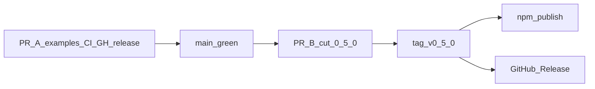

# Plan: OpenAPI CI and 0.5.0 release

Mission: make the existing OpenAPI golden fixture a CI-enforced OAS 3.1 document, stop example handlers from inventing a wire DTO, classify breaking export changes with oasdiff, and turn tag-publish into a real GitHub Release — then cut `0.5.0`.

Definition of done:

- `pnpm openapi:lint` fails when [`src/openapi/fixtures/fixture-openapi.json`](src/openapi/fixtures/fixture-openapi.json) violates Spectral `spectral:oas` validity rules.
- Pull requests that change that fixture fail CI when oasdiff reports breaking (ERR) changes versus the base branch copy.
- Pushing `v0.5.0` publishes to npm **and** creates a GitHub Release whose notes are the `## [0.5.0]` changelog section (today those tag URLs in [`CHANGELOG.md`](CHANGELOG.md) 404).
- `package.json` version is `0.5.0`; Unreleased is cut per [`AGENTS.md`](AGENTS.md).
- Mount examples return the store record (`ok(user)`); they do not rebuild a wire DTO. Conformance still proves `passwordHash` never leaves the process.

Validation:

```bash
pnpm openapi:lint
pnpm lint && pnpm typecheck && pnpm test:coverage && pnpm build
pnpm perf:check && pnpm specs:lint
pnpm examples:typecheck && pnpm examples:conformance
pnpm exec publint && pnpm exec attw --pack --profile esm-only
```

Size budget: about 18 files, roughly +80 / −80 (example remaps are deletions). An 8-agent team is oversized; three slices plus a lead cut. Exceeding this (new exporter fields, second fixture, release-please, shared handler package) triggers re-scoping.

On implementation, save this plan as [`plans/20260813-openapi-ci-0.5-release.md`](plans/20260813-openapi-ci-0.5-release.md).

qmd: queried `utility-belt`, `eddy-plans`, and `notes`. No prior Spectral/oasdiff implementation plan; in-repo sources are [`research/20260812-rest-contract-library-expectations.md`](research/20260812-rest-contract-library-expectations.md) and [`plans/20260813-contract-surface-0.5.md`](plans/20260813-contract-surface-0.5.md).

## Changes from proposal

Proposal is the research doc above (and the 0.5 plan, which shipped export without CI).

- Research said interview adopters before ordering OpenAPI vs mount/test — this plan skips interviews; 0.5 already shipped both; this deepens OpenAPI honesty.
- Research said `toOpenAPI(contract, { info, statuses })` — already shipped without `statuses`; do not reintroduce them.
- Research said lint fixtures with Spectral and oasdiff — adopt, on the existing golden file.
- Research said GitHub Releases and package metadata — add GitHub Releases; npm already ships README, LICENSE, and CHANGELOG (`files` plus npm’s always-included paths).
- 0.5 plan slice 04 wanted a conformance-contract golden — the tree uses [`src/openapi/fixtures/fixture-contract.ts`](src/openapi/fixtures/fixture-contract.ts) instead; do not add a second fixture.

## Reuse

- OpenAPI document to lint: extend [`src/openapi/fixtures/fixture-openapi.json`](src/openapi/fixtures/fixture-openapi.json). Vitest already `toEqual`s `toOpenAPI()` against it ([`src/openapi/to-openapi.test.ts`](src/openapi/to-openapi.test.ts) lines 17–23). Lint the committed file; do not regenerate in CI.
- Spectral invocation: extend the `specs:lint` pattern. No wrapper script — `lint-gherkin.mjs` exists because Gherkin rules are custom; Spectral CLI is enough: `"openapi:lint": "spectral lint src/openapi/fixtures/fixture-openapi.json"`.
- oasdiff: build via `oasdiff/oasdiff-action` (pin a release tag, `review: false`). The npm name `oasdiff` is a security placeholder (`0.0.1-security`); do not `pnpm add oasdiff`. Compare git refs of the golden file. `v0.4.1` has no OpenAPI — first baseline is the fixture already on `main`.
- CI extra check: extend [`.github/workflows/ci.yml`](.github/workflows/ci.yml). Changelog job already uses `fetch-depth: 0`; add a dedicated `openapi` job so oasdiff can see the base-branch file.
- Release gate + npm: reuse [`.github/workflows/release.yml`](.github/workflows/release.yml) (already runs the full suite then trusted publish; tag must match `package.json`).
- GitHub Release notes: build new — tags `v0.1.0`–`v0.4.1` exist, `gh api …/releases` is empty, no `gh release` step. Notes come from the versioned changelog heading, not `--generate-notes`.
- Version/tag agreement: reuse `release.yml` lines 32–41.
- Changelog cut: reuse [`AGENTS.md`](AGENTS.md) Releasing; do not add changesets/release-please.

## What stays the same

- `toOpenAPI` behaviour, `OpenApiExportError`, and the vitest golden equality test.
- `serve` / client / query / testing APIs.
- Manual Unreleased → versioned heading cut (no release-please).
- npm trusted publishing on tag.
- Coverage thresholds, `perf:check`, husky (`specs:lint` only — do not add Spectral to pre-commit).
- No auth/codegen, no Valibot peer, no streaming/multipart, no second OpenAPI fixture from the conformance contract.
- Do not extract a shared handlers package — five mount copies stay; they just stop inventing a DTO.

## Decisions (locked)

- **Spectral style vs exporter growth.** Disable only style rules a generated projection cannot satisfy (`operation-tags`, `info-contact`, `info-license`). Do not add `tags` / `contact` / `license` to `toOpenAPI` in this plan. Do **not** disable validity rules (`oas3-schema`, `operation-operationId`, `path-params`). If a validity rule fails on today’s fixture, stop — that is an exporter bug, not a ruleset tweak.
- **oasdiff fails CI on ERR** (true breaking), not WARN, and does not upload specs (`review: false`). Unchanged fixture → no diff → pass. Intentional breaking export changes are consumer-facing: they need a non-Internal changelog bullet, not a skip label.
- **Two PRs.** PR A lands example-handler cleanup + CI + GitHub Release mechanics (`### Internal`). PR B is the 0.5.0 cut after A is green on `main`. Never tag `v0.5.0` before Spectral is in `release.yml`.
- **No handler DTO maps.** `serve` already runs `parseOutput` and serialises the parsed value ([`src/server/serve.ts`](src/server/serve.ts) ~533–548). Handlers `return ok(user)`. The named `wireCandidate` object exists only to sneak extra keys past TypeScript excess-property checks — that is serialising in the handler. The validators example already returns the record ([`examples/validators/src/run.ts`](examples/validators/src/run.ts) lines 27–39).



## Coordination brief

- Slice 00 — Example handlers return domain records. Owns the five mount handler files and their READMEs. Must not touch `src/**`, workflows, or `package.json`. After: none (parallel with 01).
- Slice 01 — OpenAPI CI. Owns `.spectral.yaml`, `.github/workflows/ci.yml`, `package.json` (scripts + `@stoplight/spectral-cli` only), `pnpm-lock.yaml`. Must not touch `release.yml` or `AGENTS.md`. Exposes `pnpm openapi:lint`. Consumes the golden fixture. After: none.
- Slice 02 — GitHub Release + release-workflow parity. Owns `.github/workflows/release.yml`, `AGENTS.md`. Must not touch `package.json` or `ci.yml`. Consumes `pnpm openapi:lint`. After: 01 (script must exist).
- Lead — PR A changelog Internal bullet; PR B version cut. Owns `CHANGELOG.md` for both PRs. Slice 01 must not edit CHANGELOG.

Contested files and their single owner:

- `package.json` / `pnpm-lock.yaml` → slice 01 (scripts + spectral-cli). Lead bumps `version` only in PR B.
- `CHANGELOG.md` → lead.
- `ci.yml` → slice 01.
- `release.yml` → slice 02.
- Golden fixture / `src/openapi/**` → nobody in this plan unless Spectral validity rules prove an exporter bug (stop and report).
- Example handlers → slice 00.

## Slice 00: drop handler wire maps

Objective: examples teach `parseOutput` as the strip, not a hand-built DTO.

Owned paths:

- [`examples/express/src/handler.ts`](examples/express/src/handler.ts)
- [`examples/hono/src/handler.ts`](examples/hono/src/handler.ts)
- [`examples/next-app-router/app/api/[...path]/route.ts`](examples/next-app-router/app/api/[...path]/route.ts)
- [`examples/cloudflare-workers/src/index.ts`](examples/cloudflare-workers/src/index.ts)
- [`examples/sveltekit/src/hooks.server.ts`](examples/sveltekit/src/hooks.server.ts)
- the matching `README.md` Protocol win paragraphs in those five example folders

Leave untouched: [`examples/gateway/src/run.ts`](examples/gateway/src/run.ts) (composes `orderId` + `reservationId` from a client result — not a store-to-wire map), [`examples/validators/src/run.ts`](examples/validators/src/run.ts) (already `return ok(user)`), conformance scenarios (they assert the wire, not handler shape).

Steps:

1. `getUser`: `return ok(user)` after the not-found check.
2. `createUser`: `users.set(id, user); return ok(user)`.
3. `listUsers`: `return ok([...users.values()])`.
4. Keep `UserRecord` with `passwordHash` in the Map — that is the point of the conformance leak test.
5. Replace the handler comment that says extra fields are “below” in a rebuilt object. One line: handlers return the store record; `serve` parses output and serialises that.
6. README Protocol win: handlers return the store record including `passwordHash`; `parseOutput` strips it. Do not say they “return a user object that still includes” via a remap.

Acceptance: `pnpm examples:typecheck` and `pnpm examples:conformance` pass; no `wireCandidate` / `wireCandidates` in `examples/`.

## Declared interfaces

```text
pnpm openapi:lint
  → spectral lint src/openapi/fixtures/fixture-openapi.json
  → exit 0 / 1
```

```yaml
# ci.yml job `openapi`, pull_request only for oasdiff
base: 'origin/${{ github.base_ref }}:src/openapi/fixtures/fixture-openapi.json'
revision: 'HEAD:src/openapi/fixtures/fixture-openapi.json'
fail-on: ERR
review: false
```

```text
# release.yml after npm publish
gh release create "$GITHUB_REF_NAME" \
  --title "$GITHUB_REF_NAME" \
  --notes "<markdown of ## [x.y.z] section, Internal already dropped at cut>"
```

## Slice 01: OpenAPI CI

Objective: Spectral locally and in PR CI; oasdiff breaking check against the base-branch golden file.

Owned paths: [`.spectral.yaml`](.spectral.yaml) (new), [`.github/workflows/ci.yml`](.github/workflows/ci.yml), [`package.json`](package.json), [`pnpm-lock.yaml`](pnpm-lock.yaml).

Steps:

1. Add `@stoplight/spectral-cli` as a devDependency and `"openapi:lint": "spectral lint src/openapi/fixtures/fixture-openapi.json"`.
2. Add `.spectral.yaml` with `extends: ["spectral:oas"]` and `off` for `operation-tags`, `info-contact`, `info-license` only. Run `pnpm openapi:lint` against the current fixture; if a **recommended validity** rule fails, stop and report — do not silence it and do not change the exporter in this slice.
3. In `ci.yml`, add job `openapi`: checkout with `fetch-depth: 0`, pnpm/Node 24 as `check`, `pnpm openapi:lint`. On `pull_request` only, `git fetch origin ${{ github.base_ref }}` and run pinned `oasdiff/oasdiff-action/breaking` with the interface above. Push-to-main skips oasdiff (no PR base).
4. Do not add husky, a `scripts/*.mjs` wrapper, a conformance OpenAPI, or oasdiff as an npm dependency.

Acceptance: `pnpm openapi:lint` is green on today’s fixture (or a written validity-rule blocker). A synthetic PR that deletes a path from a copy of the fixture fails oasdiff; a no-op fixture PR passes.

## Slice 02: GitHub Release and release-workflow parity

Objective: tag publish also creates a GitHub Release; release CI lints OpenAPI so 0.5.0 cannot ship an invalid fixture.

Owned paths: [`.github/workflows/release.yml`](.github/workflows/release.yml), [`AGENTS.md`](AGENTS.md).

Steps:

1. After install (Spectral needs no `build`), run `pnpm openapi:lint` in `release.yml` next to the existing gate (mirror the new check; oasdiff stays PR-only).
2. Job permissions: keep `id-token: write`; add `contents: write`. After successful `npm publish`, `gh release create` with notes from the matching `## [x.y.z]` section of `CHANGELOG.md` (inline awk/sed in the step is enough — no new script). `fail` if that heading is missing so a mismatched cut cannot publish a empty release.
3. Update AGENTS.md Releasing: GitHub Release is created by the tag workflow; `openapi:lint` is part of CI and release; Internal is still dropped at cut.

Acceptance: a dry read of the workflow shows `contents: write`, `openapi:lint`, and `gh release create`. AGENTS.md lists the GitHub Release as automatic.

## Lead: PR A changelog, then PR B 0.5.0 cut

PR A (after slices 00–02): `### Internal` bullets — example handlers return domain records; Spectral/oasdiff on the golden fixture; GitHub Releases on tag.

PR B, only after A is green on `main`:

1. Move [`CHANGELOG.md`](CHANGELOG.md) `## [Unreleased]` consumer entries under `## [0.5.0] - 2026-08-13`. Leave Unreleased empty. Drop `### Internal`.
2. Link defs: `[Unreleased]: …/compare/v0.5.0...HEAD`; add `[0.5.0]: …/releases/tag/v0.5.0`.
3. Set `package.json` `"version"` to `0.5.0`.
4. Merge, then push tag `v0.5.0`. Release workflow must refuse publish if tag ≠ version (already implemented).

Do not combine the version bump with PR A.

## What this plan refuses to add

- `scripts/lint-openapi.mjs` — the CLI is the script.
- Composite action to de-duplicate `ci.yml` / `release.yml` — two extra steps, not a new system.
- oasdiff.com upload, PR comments, `pull-requests: write`.
- Second golden from [`examples/packages/shared-contract`](examples/packages/shared-contract/src/contract.ts).
- Growing `OpenApiOptions` with contact/license/tags.
- changesets / release-please.
- A shared `examples/packages/shared-handlers` package — five copies stay; they just stop remapping.

## Handoff

Riskiest slice: **01** (Spectral validity surprises on `$schema` inside OAS 3.1 schema objects; oasdiff-action pin). Suggested implement: one agent sequential, or two agents with slice 02 after 01. Not `eng-team-implement` at 8.
